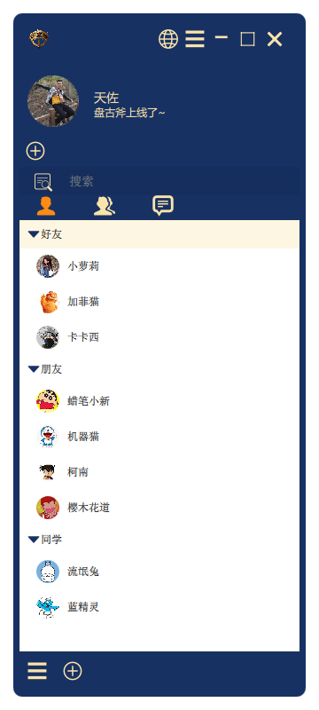
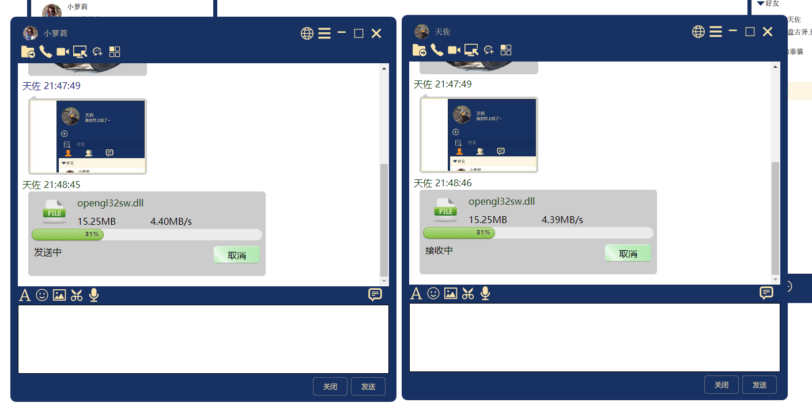
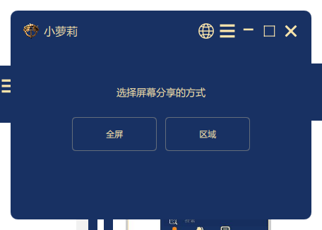
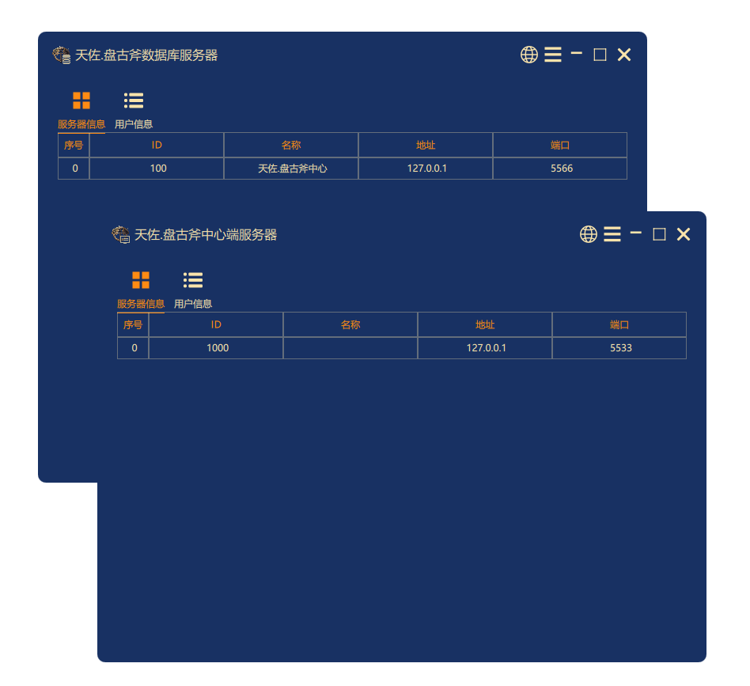
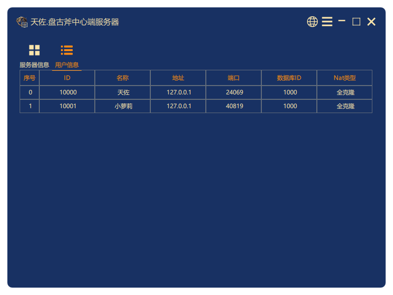

<h4 align="right"><strong><a href="README.md">简体中文</a></strong> | English</h4>

### tianzuo.Pangu

||||
|--|--|--|
|operating system|    ||
|compiler|       ||
|programming language| ||

# introduction

**tianzuo.Pangu** Instant messaging platform, using self-developed distributed storage and UDP reliable P2P network transmission technology, self-developed IM communication protocol, covering mainstream platforms, plug-in high scalability, OpenGL rendering high smooth UI, supporting integrated web applications, can be deployed privately or in the public cloud.

**legend:**
According to legend, at the beginning of the chaos of heaven and earth, Pangu woke up from his sleep and saw the darkness of heaven and earth, so he reached out and took out a huge axe to split the earth and earth, and since then there is our world. This axe has the power to separate heaven and earth and shuttle too empty, and the power is not the Xuanyuan sword. Rumor has it that whoever controls the Pangu axe controls the Law of power.

# motivation
Build CS architecture IM communication system, support text/expression/picture/voice/video/remote desktop/remote control/whiteboard and other functions.

# features

- 🧩 simple integration
- 📦 private deployment is supported
- 🪢 chat data point-to-point encryption, independently developed IM protocol, network library using 'Tenzo. Day Boot 'software development kit
- 📒 save chat logs locally, use 'Tenzo' database. Qiankun Bag 'software development kit

# screenshot

**tianzuo.Pangu Demo:**

# download

|||||
|--|--|--|--|
|||||

# about
## contact

||||
|--|--|--|
|author|zhengtianzuo||
|QQ|278969898||
|mailbox|camelsoft@163.com||
|homepage|[http://www.camelstudio.cn](http://www.camelstudio.cn)||
|blog|[http://blog.csdn.net/zhengtianzuo06](http://blog.csdn.net/zhengtianzuo06)||
|github|[https://github.com/zhengtianzuo](https://github.com/zhengtianzuo)||
|gitee|[https://gitee.com/zhengtianzuo](https://gitee.com/zhengtianzuo)||
|QQ group|199672080||

|||||
|--|--|--|--|
|Add QQ Friends|Add WeChat Friends|WeChat Sponsor|Alipay Sponsor|

